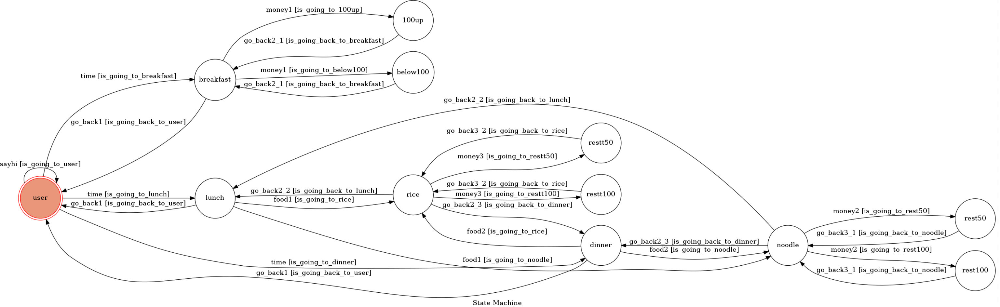

# 吃什麼不煩惱ChatBot

每天都在煩惱吃什麼嗎?    
從今天開始，不用再煩惱了!       
只要輸入想吃的類型，他就會推薦你每一餐的好選擇^^

## Finite State Machine

## Usage
>user  

The initial state is set to `user`.

Every time `user` state is triggered to `sayhi` to the same state, it will stay at the state `user` after the bot replies corresponding message.

	* Input: "Hello"
		* Reply: "Nice to meet you! What do you want to eat? Breakfast, lunch or dinner?"

Every time `user` state is triggered to `time` to another state, it will stay at the state after the bot replies corresponding message.

	* Input: "breakfast"
		* Reply: "Good morning! How much budget do you have?  
		Enter a for below NT100  
		Enter b for NT100up"
After input "breakfast", it will stay at state `breakfast`.  

	* Input: "lunch"  
		* Reply: "Okay! Which one do you prefer? Noodle or rice?"  
After input ""lunch", it will stay at state `lunch`.
    
    * Input: "dinner"  
        *Reply: "Okay! Which one do you prefer? Noodle or rice?"   
After input "dinner", it will stay at state `dinner`.
 
Besides, we can input "back to [PRIVIOUS STATE]" at any following states to return to the previous state.  
 
>breakfast  

Every time `breakfast` state is triggered to `money1` to another state, it will stay at the state after the bot replies corresponding message.

     * Input: "a"
		*It will recommend a breakfast shop you may not cost over NT100.
        *It is also available to click the link to get the location on google map.
After input "a", it will stay at state `below100`.   

     * Input: "b"
		*It will recommend a breakfast shop you may cost over NT100.
        *It is also available to click the link to get the location on google map.
After input ""b", it will stay at state `100up`.   

>lunch & dinner  

Every time `lunch` state is triggered to `food1` to another state, it will stay at the state after the bot replies corresponding message.

     * Input: "noodle"
		*How much is your budget?
         Enter 1 forNT50-100
         Enter 2 for NT100-200
After input "noodle", it will stay at state `noodle`.   

     * Input: "rice"
		*How much is your budget?
         Enter 1 forNT50-100
         Enter 2 for NT100-200
After input "rice", it will stay at state `rice`.

>noodle  

Every time `noodle` state is triggered to `money2` to another state, it will stay at the state after the bot replies corresponding message.

     * Input: "1"
		*It will recommend a restaurant you may cost between NT50-100.
        *It is also available to click the link to get the location on google map.
After input "1", it will stay at state `rest50`.   

     * Input: "2"
		*It will recommend a restaurant you may cost between NT100-200.
        *It is also available to click the link to get the location on google map.
After input "2", it will stay at state `rest100`. 

>rice  

Every time `rice` state is triggered to `money3` to another state, it will stay at the state after the bot replies corresponding message.

     * Input: "1"
		*It will recommend a restaurant you may cost between NT50-100.
        *It is also available to click the link to get the location on google map.
After input "1", it will stay at state `rest50`.   

     * Input: "2"
		*It will recommend a restaurant you may cost between NT100-200.
        *It is also available to click the link to get the location on google map.
After input "2", it will stay at state `rest100`. 

## Author
[hwacheng](https://github.com/hwacheng)
